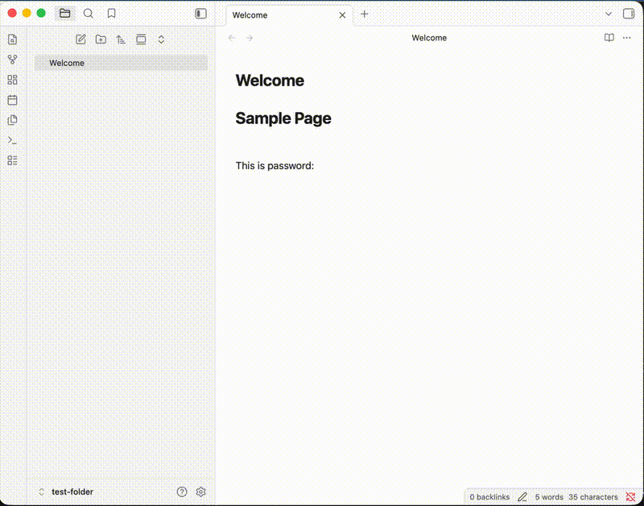

# Markdown Password

**Markdown Password** is a professional-grade Obsidian plugin that introduces a standardized, secure way to embed encrypted secrets directly into your Markdown files. It advocates for the universal format `[|vault:id|]`, ensuring your sensitive data remains private even when your notes are processed by cloud services or AI.

---

## 🎯 Design Philosophy

This plugin is designed with three core objectives:

1.  **Markdown-Native Secrets**: Establish `[|vault:id|]` as a standard for secrets. Only the ID is stored in the `.md` file, keeping your content clean and sync-safe.
2.  **Privacy from AI & Cloud**: Since the actual secrets are decoupled from the Markdown text, they are invisible to AI models (LLMs), sync providers (iCloud/Dropbox), and search indexers.
3.  **Auditability & Visibility**: While secrets are hidden from the file, they remain accessible within Obsidian for the user. Any modification to the secrets can be tracked via logs, providing a clear audit trail for sensitive operations.

---

## 🌟 Key Features

- **Zero-Persistence Model**: Your Master Key and decrypted Vault Key live **only in RAM**. They are never written to disk.
- **Auto-Encryption**: Simply type `[|your-secret|]` and the plugin automatically converts it to a secure `[|vault:id|]` placeholder.
- **Seamless Integration**: Works in both Editor (Live Preview) and Reading modes, revealing the real secret only when authorized.
- **Decoupled Storage**: Secrets are stored in a local `vault.json`, isolated from your primary vault content.

---

## 🚀 How to Use

### 1. Initial Setup
When you first use the plugin, you will be prompted to set a **Master Key**. 
> [!CAUTION]
> **Warning**: There is no "Password Recovery" feature. If you lose your Master Key, your secrets cannot be decrypted.

### 2. Create/Encrypt a Secret
In the editor, simply type your secret inside the password brackets: `[|my-secret-password|]`.
If your status is **Unlocked (Auto-encrypt ON)**, the plugin will automatically:
1. Encrypt the text using **AES-256-GCM**.
2. Store the encrypted data in `vault.json`.
3. Replace your text with a secure placeholder: `[|vault:v_abc123|]`.

> [!IMPORTANT]
> If the vault is **Locked**, typing `[|secret|]` will remain as plain text and will **not** be protected.

### 3. Unlock/Lock Secrets
- **Unlock & Auto-Encrypt**: Use Command Palette (`Cmd + P`) -> `Markdown Password: Unlock & Auto-Encrypt`. Enter your Master Key to reveal all secrets and enable automatic encryption for new input.
- **Lock & Disable Encryption**: Use Command Palette (`Cmd + P`) -> `Markdown Password: Lock & Disable Encryption`. This clears the keys from memory and stops the auto-encryption process.

---

## 🛡️ Security Specs & Privacy

### Cryptography
- **Key Derivation**: PBKDF2 with 100,000 iterations and SHA-256 salt.
- **Encryption**: AES-256-GCM (Authenticated Encryption).
- **Zero-Storage**: The Master Key is never stored on disk.

### Data Storage
- **Vault File**: All encrypted payloads are stored in `.obsidian/plugins/markdown-password/vault.json`.
- **Sync Recommendation**: For maximum security, we recommend **excluding** `vault.json` from your sync provider (e.g., adding it to `.gitignore` or unchecking it in Obsidian Sync).

---

## ⚙️ Installation

### Community Plugins (Coming Soon)
Search for `Markdown Password` in the Obsidian Community Plugins browser and click Install.

### Manual Installation
1. Download `main.js`, `manifest.json` from the [latest release](https://github.com/hoyin258/markdown-password/releases).
2. Create a folder named `markdown-password` in your vault's plugin directory: `<vault>/.obsidian/plugins/`.
3. Move the downloaded files into that folder.
4. Reload Obsidian and enable the plugin in Settings.

---

## 🛠️ Local Development

1. Clone the repository.
2. Install dependencies: `npm install`.
3. Build the plugin: `npm run build`.
4. Run unit tests: `npm run unit-test`.

---

## 📄 License

This project is licensed under the [MIT License](LICENSE).

---
Created with ❤️ by [hoyin258]
